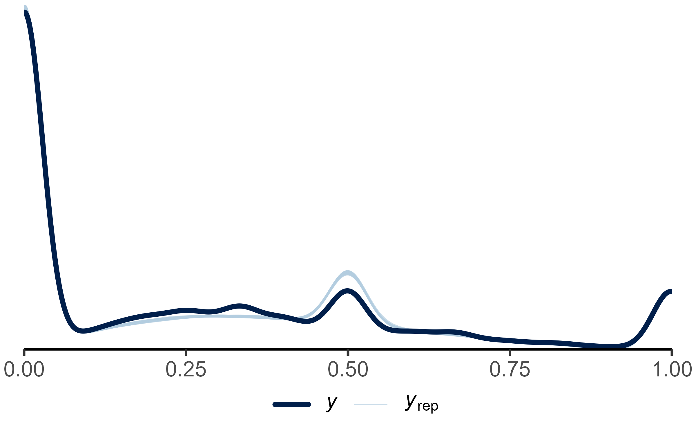

In this project, I am working on building a existing mixture model analysis of advice-taking into a metaanalytic model. 

{width="30%"}

:::: {.columns}
::: {.column width=66%}
Visit the analysis site for this work-in-progress project here:
:::
::: {.column width=33%}
[ADVICE-TAKING METAANALYSIS](https://jhelmer3.github.io/advice-taking-metaanalysis){.btn .btn-outline}
:::
::::

